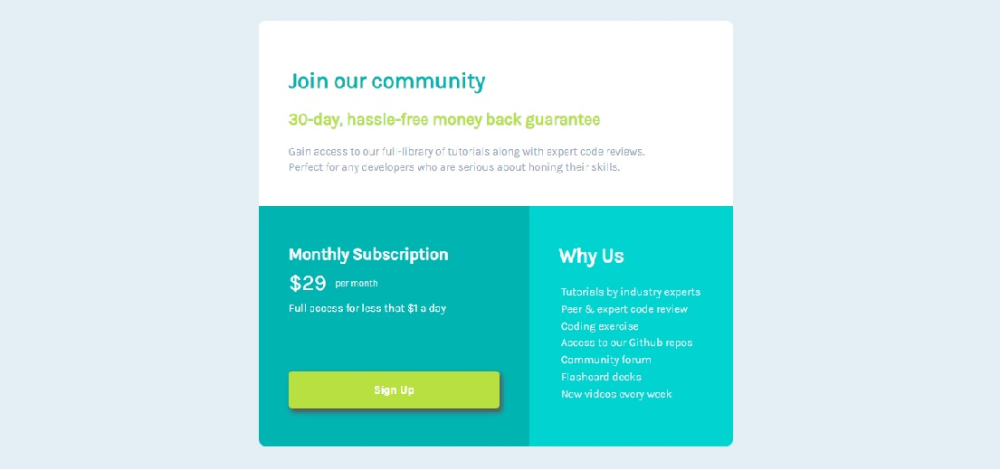

# Frontend Mentor - Single price grid component solution

This is a solution to the [Single price grid component challenge on Frontend Mentor](https://www.frontendmentor.io/challenges/single-price-grid-component-5ce41129d0ff452fec5abbbc). Frontend Mentor challenges help you improve your coding skills by building realistic projects. 

## Table of contents

- [Overview](#overview)
  - [The challenge](#the-challenge)
  - [Screenshot](#screenshot)
  - [Links](#links)
- [My process](#my-process)
  - [Built with](#built-with)
  - [What I learned](#what-i-learned)
  - [Continued development](#continued-development)
  - [Useful resources](#useful-resources)
- [Author](#author)

## Overview

### The challenge

Users should be able to:

- View the optimal layout for the component depending on their device's screen size
- See a hover state on desktop for the Sign Up call-to-action

### Screenshot

### Links

- Solution URL: (https://www.frontendmentor.io/solutions/simple-price-grid-component-using-html-and-css--4B8vR2ug2)
- Live Site URL: (https://ahmed7019.github.io/single_price_component/)

## My process

### Built with

- Semantic HTML5 markup
- CSS custom properties
- CSS Grid

### What I learned

I learned more about dealing with css grid .

### Continued development

As i learned css grid i will continue developing my skills and try to expand my knowledge of css grid

### Useful resources

- (https://www.w3schools.com/css/css_grid.asp) - This is a website you must check as it provides great tutorials for grid and everything about css and web design in general 

## Author

- Frontend Mentor - [@Ahmed7019](https://www.frontendmentor.io/profile/Ahmed7019)
- Twitter - [@titch7109](https://www.twitter.com/titch7109)

